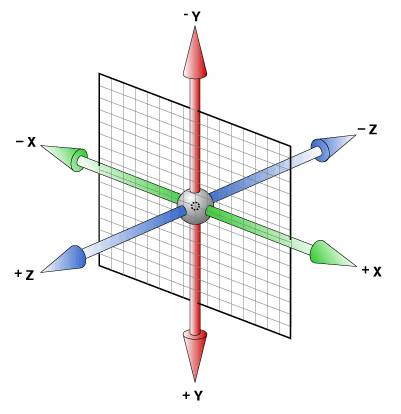

# preserve-3d和perspactive

CSS 属性 transform-style 设置元素的子元素是位于 3D 空间中还是平面中。

preserve-3d表示位于3D空间

flat表示位于平面空间

CSS 属性 *perspective*指定了观察者与 z=0 平面的距离，使具有三维位置变换的元素产生透视效果。 z>0 的三维元素比正常大，而 z<0 时则比正常小，大小程度由该属性的值决定。

三维元素在观察者后面的部分不会绘制出来，即 z 轴坐标值大于 perspective 属性值的部分。

CSS3中的3D坐标系与上面的左手坐标系有一定区别的，相当于其绕着X轴旋转了180度。但是css3的3d坐标系还是属于左手坐标系。

观察者站轴的正方向看向负方向，旋转物体，逆时针为负，顺时针为正。

*backface-visible*字面意义是背面是否可见。这个属性并不是用来控制遮挡的，而是当控制当元素被旋转了180deg后，这个元素显示的是它的背面。这个背面是否可见。可以想象成一张纸，纸有两面，但是我们只画了一面。当我们把这张纸翻面过后，我们看到的是空白还是这张纸的透明显示（透明显示可以理解为我们把纸通关光穿透看）。

## 如何实现色子的下面这一面

色子的下面这一面可以看做把正面先向前旋转90度（X轴逆时针旋转90deg），然后在向里面位移这个面高度的距离(translateY: 100%, 为什么向里面移动是translateY呢？因为旋转的是将坐标系旋转了。可以用左手试试，先摆出css的左手坐标系（拇指X轴正，食指Y轴正，中指Z轴正），然后将其沿着X轴逆时针旋转90deg，这个时候，指向里面的是食指)。为什么不直接X轴顺时针旋转90度呢？因为这个旋转后，数字这一面，也就是正面被放到里面了。
